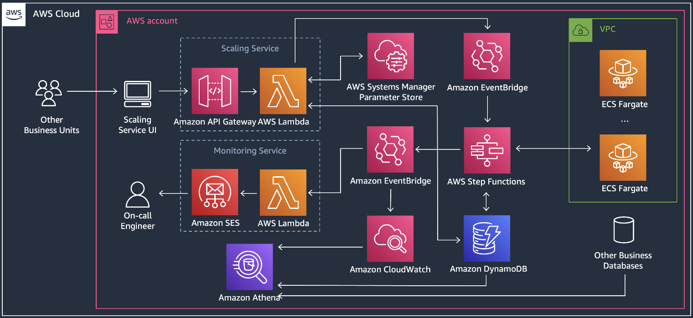

# Overview
This repo is an AWS solution for a sports wearing company to automatically scale out ECS tasks before shoes launch, and scale in after launch. The following requirements are meet:

* `Automatic process` – EventBridge manages the scheduling and Step Functions manages the scaling process, no human intervention needed.
* `End-to-end monitoring` – The entire process is visualized live in Step Functions. Events are logged.
* `Easy to maintain` – Use CDK for Infrastructure as Code. Easy to update and deploy.
* `Serverless` – The entire stack is serverless (Lambda, Step Functions, DynamoDB, etc)
* `High Availability` – AWS services used in this solution have High Availability by design.


## Architecture

The monitoring service is not implemented in this repo.

## CDK

The `cdk.json` file tells the CDK Toolkit how to execute your app.

This project is set up like a standard Python project.  The initialization
process also creates a virtualenv within this project, stored under the `.venv`
directory.  To create the virtualenv it assumes that there is a `python3`
(or `python` for Windows) executable in your path with access to the `venv`
package. If for any reason the automatic creation of the virtualenv fails,
you can create the virtualenv manually.

To manually create a virtualenv on MacOS and Linux:

```
$ python3 -m venv .venv
```

After the init process completes and the virtualenv is created, you can use the following
step to activate your virtualenv.

```
$ source .venv/bin/activate
```

If you are a Windows platform, you would activate the virtualenv like this:

```
% .venv\Scripts\activate.bat
```
